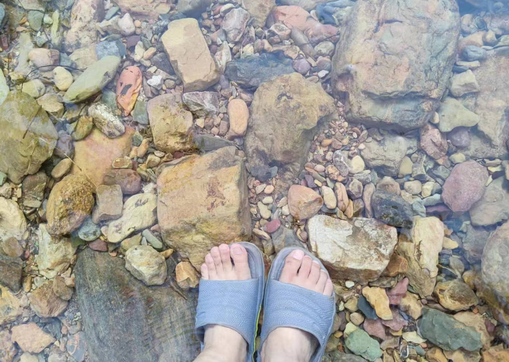

昨天老婆看到一个js水波特效，问我怎么实现，我看了下，是用jquery.ripples做的。那能不能转成vue写呢

jquery.ripples: https://github.com/sirxemic/jquery.ripples

- 将$及其方法替换掉，更新为现代代码风格
- 重写Ripples类，去掉一些啰嗦的代码，保留核心代码
  * 初始化一个容器元素，append是个canvas，设置canvas浮动在容器上面
  * 初始化canvas webgl，设置各种参数
- 波纹算法部分是用WebGLRenderingContext实现的，改天再研究看看
- 波纹效果要配一张背景图才好看，试试md向component传图片参数
  * 能通过attrs传递过去，单数会包一个警告
  * 在组件中要()=>import(attrs.image)加载出url，然后通过Ripple的imageUrl参数传递进去
  * 最好使用nextTick初始化Ripple，防止dom没准备好而出现异常效果

<!--  -->

<waterRipple image="../../wp/2023/images/river.jpg"/>