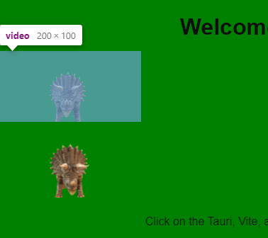

ffmpeg  
`-i dd.webm`  
`-f lavfi -i color=c=0xff000000:s=640x320,format=rgba`  
`-filter_complex "[0:v]chromakey=0x00da08:0.1:0.2[ckout];[1:v][ckout]overlay[out]"`  
`-map "[out]" -t 9 -y output.webm`

通过 `lavfi` 创建一块跟视频一样大的透明色虚拟输入，`format=rgba` 添加alpha通道，很重要  
`filter_complex` 复合滤镜将透明色覆盖掉视频中的绿幕背景  
普通视频播放器可能不支持带透明色的视频，能播放但看不到透明效果  
需要放到浏览器中才能看到

参考:  
http://underpop.online.fr/f/ffmpeg/help/chromakey.htm.gz  
https://qa.1r1g.com/sf/ask/3242083841/
