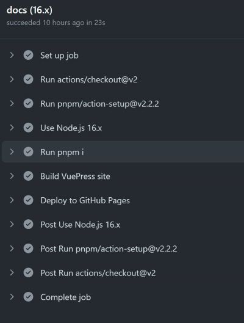

看了一个视频教程教怎么用vuepress开发一个静态网站，我想就把我wordpress的文章挪过来吧
没想到一步步抄作业竟然还是遇到很多坑。\
web：https://press.suboy.cn/\
github：https://github.com/suboy/vuepress-book

1. 新版的vuepress(2.0.0-beta.62)的目录结构不一样，会多一个docs目录来放文档，这样做就很适合自带文档的项目使用了
2. 教程还说可以加adSense，我还特意去注册了google广告，不过好像并没有效果
3. 在配置config.js时，使用glob就比较方便把md文件统计出来，整理成侧边栏。sidebar中配置对应的md路径即可，会自动生成链接
``` js
import { defineUserConfig } from 'vuepress'
import { defaultTheme } from '@vuepress/theme-default'
import { googleAnalyticsPlugin } from '@vuepress/plugin-google-analytics'
import { registerComponentsPlugin } from '@vuepress/plugin-register-components'
import { globSync } from 'glob'
import path from 'path'

const wpPath = 'docs/wp/**/*.md'
const mdList = globSync(wpPath, { ignore: 'node_modules/**' }).map(p=>{
  return p.split(path.sep).join('/').replace(/^docs(.+)/, '$1')
})
console.log(wpPath, mdList)
// <script async src="https://pagead2.googlesyndication.com/pagead/js/adsbygoogle.js?client=ca-pub-9615232600361986" crossorigin="anonymous"></script>
export default defineUserConfig({
  lang: 'zh-CN',
  title: '开发笔记',
  description: 'Just playing around',
  base: '/',
  head: [['script', { src: 'https://pagead2.googlesyndication.com/pagead/js/adsbygoogle.js?client=ca-pub-9615232600361986', async:true, crossorigin: 'anonymous' }]],
  theme: defaultTheme({
    navbar: [{
      text: 'suboy',
      link: 'https://www.suboy.cn'
    }],
    sidebar: [{
      text: '前言',
      link: '/'
    },
    ...mdList
    ]
  }),
  plugins: [
    googleAnalyticsPlugin({
      id: 'G-1PPH0NSYVE'
    }),
    registerComponentsPlugin({
      components: {
        adSense: path.resolve(__dirname, './components/adSense.vue')
      }
    })
  ]
})

```
4. 接下来是配置workflow脚本，遇到的坑就是使用crazy-max/ghaction-github-pages@v3发布的时候，记得修改build_dir和GITHUB_TOKEN
5. Settings/Developer settings，不要使用github新的Fine-grained personal access tokens，要用Personal access tokens。还有一个坑是在项目添加secret时不能使用GITHUB_开头，需要改一个名
``` yaml
name: docs

on:
  # trigger deployment on every push to main branch
  push:
    branches: [master]
  # trigger deployment manually
  workflow_dispatch:

jobs:
  docs:
    runs-on: ubuntu-latest

    strategy:
      matrix:
        node-version: [16.x]

    steps:
      - uses: actions/checkout@v2
        with:
          # fetch all commits to get last updated time or other git log info
          fetch-depth: 0
      - uses: pnpm/action-setup@v2.2.2
        with:
          version: 7.17.0
      - name: Use Node.js ${{ matrix.node-version }}
        uses: actions/setup-node@v2
        with:
          node-version: ${{ matrix.node-version }}
          cache: 'pnpm'
      - run: pnpm i

      # run build script
      - name: Build VuePress site
        run: pnpm run build

      - name: Deploy to GitHub Pages
        uses: crazy-max/ghaction-github-pages@v3
        with:
          # deploy to gh-pages branch
          target_branch: gh-pages
          # deploy the default output dir of VuePress
          build_dir: docs/.vuepress/dist
        env:
          # @see https://docs.github.com/en/actions/reference/authentication-in-a-workflow#about-the-github_token-secret
          GITHUB_TOKEN: ${{ secrets.VUEPRESS_TOKEN }}

```

6. build deploy都没问题就能发布到gh-page去了\

7. 添加https在项目的settings/pages/Custom domain，事先要准备域名cname到github.io的page，然后再这里启用https，证书什么的github会帮你搞好
8. 每次发布都要重新配置一遍自定义域名

<adSense/>